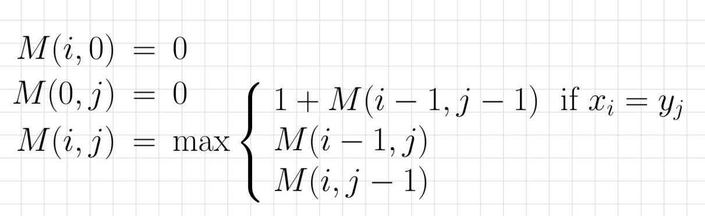
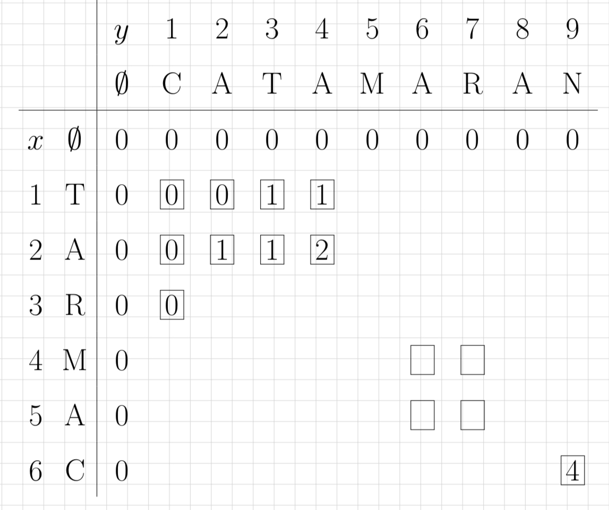

# E-Leet Coding Workshop

## Summary

This was the workshop I co-presented for the Waterloo Data Science Club (WDSC) in Winter 2022. This workshop went over the approach and analysis for solving two LeetCode problems. I presented and analyzed the [Longest Common Subsequence](https://leetcode.com/problems/longest-common-subsequence/) problem. I first presented a brute force/recursive solution which had runtime of O(2^nm). This solution exceeds the time limit and is only able to solve the problem within the time limit when the two strings have a collective length of 28. I then revised the solution to use dynamic programming, which has a runtime of O(nm).

## Brute Force Approach

The brute force approach gets all the subsequences of each string and finds the longest one that they share. Let the first string have length n and the second string have length m. Therefore, they have 2^n and 2^m subsequences respectively. Therefore, the runime is O(2^nm). This yields a time limit exceeded error. You can find the code for the brute force approach [here](). 

## Dynamic Programming Approach

For the dynamic programming approach, we first initalize a n x m matrix to store the answers to each subproblem. Each subproblem is finding the longest common subsequence for substrings of text1 and text2. To evaluate each subproblem, we use the formula shown below. Therefore, we have nm subproblems and each subproblem takes a constant amount of work so the runtime is O(nm). You can find the code for the dynamic programming approach [here](). Credit to Professor Arne Storjohann for the visuals.

## YouTube

The workshop was recorded and uploaded to YouTube! You can watch the video [here]().
